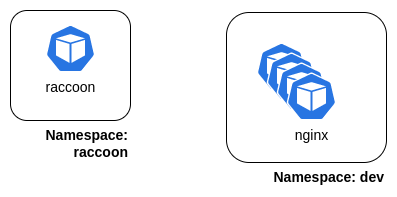

# Run raccoon locally inside a kubernetes cluster

## Pre-requisite 

* A Kubernetes cluster up & running. It can be a local cluster such as [Minikube](https://minikube.sigs.k8s.io/docs/start/) or [kind](https://kind.sigs.k8s.io/) or any other Kubernetes cluster you have access. 

> :warning: **WARNING** Do not run this procedure in a production environment!

## Architecture

Below is a diagram of the local architecture we're going to deploy



As you can see, we're going to deploy raccoon in a dedicated namespace. The goal is to target nginx's pods deployed in the `dev` namespace.

## Deploy

First, we need to create the `raccoon` namespace and the cluster role that will allow raccoon to list and delete specific resources.  
To do that, just run the following: 

```
kubectl apply -f ./rbac.yaml
```

Now, we need to deploy raccoon

```
kubectl apply -f ./raccoon.yaml
```
At this point, raccoon should be up and running in the `raccoon` namespace. This raccoon instance is looking for pods in the `dev` namespace with labels `app=nginx` and `env=local`.

So, let's deploy nginx 

```
kubectl apply -f ./nginx.yaml
```
Et voilà!

If you look at your nginx pods, you should see them being terminated randomly by raccoon.  
This means that raccoon is up and running and well configured.